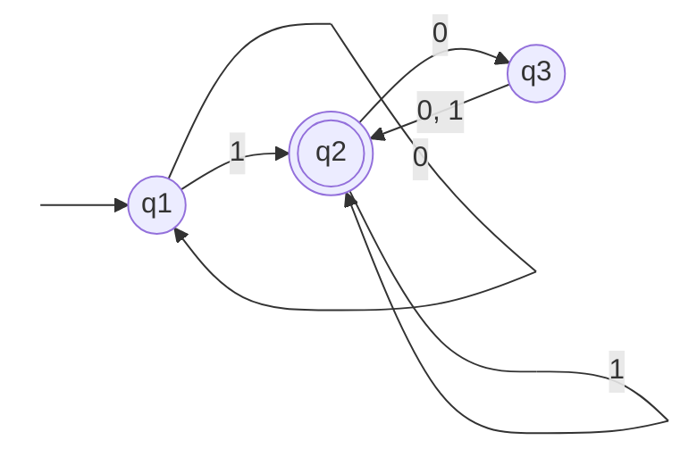
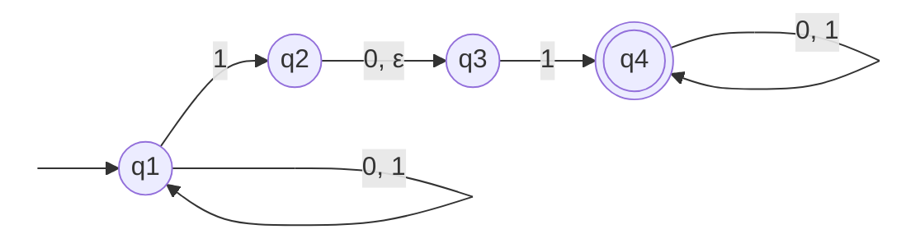
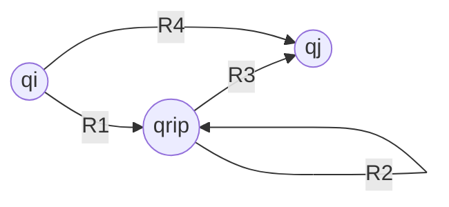
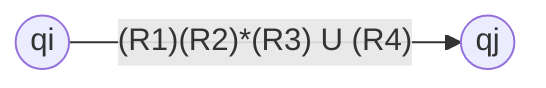

___

##### FINITE AUTOMATA (DFAs)

 **Finite Automata** are models for computers with an extremely limited amount of memory. An Automata receives an input string and recognizes a language. From the graphical point it is represented by a **State Diagram**.

>[!example] DEFINITION:
>A **Finite Automaton DFAs** is a **5-tuple** ($Q, \Sigma, \delta, q_0, F)$), where
>	1. $Q$ is a finite set called the **States**,
>	2. $\Sigma$ is a finte set called the **Alphabet**,
>	3. $\delta : Q \times \Sigma \longrightarrow Q$ is the **Transition Function**,
>	4. $q_0 \in Q$ is the **Start State** , and
>	5. $F \subseteq Q$ is the **Set of** **Accept States**.

>[!info] The **Transition Function** is the element that defines the **movement** to go from a phase to another

###### DFAs State Diagram:

---

##### FORMAL DEFINITION  OF COMPUTATION
The Formal Definition is needed to describe how an automata executes his calculations avoiding any ambiguity. 
Given a Finite Automata $M = (Q, \Sigma, \delta, q_0, F)$ and an input string $w = w_1w_2 \dots w_n$, we define that the machine $M$ **accepts** the string $w$ if exists the sequence of states $r_0, r_1, \dots, r_n$ in $Q$ that respects **3 conditions**.

>[!example] Sequence of States
>The **3** conditions:
>	1. $r_0 = q_0$ : the machine starts to execute from the **initial** state,
>	2. $\delta(r_i, w_{i+1}) = r_{i+1}$: the machine moves through states respecting the **Transition Function** , and
>	3. $r_n \in F$: the machine **accepts** the string if ,at the end of it, it is inside one of the **Final** or **Accept** states.
>Than we say that $M$ **recognizes language** $A$ if $A = \{w \mid M \text{ accepts } w\}$

>[!example] DEFINITION:
>A language is called a **Regular language** if some finite automaton  recognizes it.

---

##### REGULAR OPERATIONS
The **Regular Operations** are mathematical instruments build in a specific way for the manipulation of languages inside the **Computational Theory**.

>[!example] OPERATIONS:
>Let $A$ and $B$ be languages. We define the regular operations **union**, **concatenation**, and **star** as follows:
>	1. **Union**: $A \cup B = \{ x \mid x \in A \text{ or }x \in B \}$.
>	2.**Concatenation**:  $A \circ B = \{ xy \mid x \in A \text{ and }y \in B \}$
>	3.**Star**: $A^\ast = \{ x_1x_2 ...x_k \mid k \geq 0, \ \forall \ x_i \in A \}$

---

##### NONDETERMINISM

Differently from a **Deterministic** approach the **Nondeterminism** is a stage for multiple possibilities that can be interpreted like a **parallel computing** where various independent processes are executes simultaneously or we can see it like a **Tree of possibilities (NFA)** where the automaton **accepts** the input if at least one **branch of the computation tree** ends in an **Accepting State**.

---

#### NON DETERMINISTIC AUTOMATA (NFAs)

The definition of the **NFA** is similar to DFA except for the **Transition Function** $\delta$ that takes a state and an input symbol or the **empty string** $\varepsilon$ and produces the **set of possible next states**. 
In addition we ca say that a **NFA** and a **DFA** are **equivalent** if they recognize the same language.

>[!example] DEFINITION:
>A **nondeterministic finite automaton** is a **5-tuple**  ($Q, \Sigma, \delta, q_0, F)$), where
>	1. $Q$ is a finite set called the **States**,
>	2. $\Sigma$ is a finte set called the **Alphabet**,
>	3. $\delta: Q \times \Sigma_\epsilon \longrightarrow \mathcal{P}(Q)$ is the **Transition Function**,
>	4. $q_0 \in Q$ is the **Start State** , and
>	5. $F \subseteq Q$ is the **Set of** **Accept States**.

>[!info] ADDITIONAL NOTATION:
>1. For any set $Q$ we write $\mathcal{P}(Q)$ to be a collection of **subsets** of $Q$ and we call it the **Power Set** of $Q$.
>2. For any alphabet $\Sigma$ we write $\Sigma_\epsilon$ to be $\Sigma \cup \{\varepsilon\}$.

###### NFAs State Diagram:

---

##### CLOSURE UNDER THE REGULAR OPERATIONS

In mathematics and in the theory of computation, a **collection of elements** (a set) it's said **"closed"** under a specific operation if applying the operation to the elements the final result is an object that **stills belong** to the set .

---

##### REGULAR EXPRESSIONS

In arithmetic we use mathematical operation such as **sum** and **product** to build expressions. 
Similarly we can use the **regular expressions** seen before to create  expressions that describe **languages**, which are called **regular expressions**.

>[!example] DEFINITION:
>Say that $R$ is a **regular expression** if $R$ is
>	1. $a$ for some $a$ in the alphabet $\Sigma$,
>	2. $\varepsilon$,
>	3. $\emptyset$,
>	4. $(R_1 \cup R_2)$, where $R_1$ and $R_2$ are regular expressions,
>	5. $(R_1 \circ R_2)$, where $R_1$ and $R_2$ are regular expressions, or
>	6. $(R_1^\ast)$, where $R_1$ is a regular expression.

>[!warning] 
>$\varepsilon$ and $\emptyset$ are not the same thing, the first one comes with **one** empty string and the second indicates an **empty language** so **no strings**.

---

##### GENERALIZED NONDETERMINISTIC FINITE AUTOMATON (GNFAs)

**GNFAs** are a particular variant of **NFAs** where the arrow tags can be made up with **full regular expressions** and not only with alphabet symbols.
During the computation a GNFA moves along the transition arrows by reading **blocks of symbols** directly from the input, provided that these blocks correspond to a string described by the **regular expression** placed on the arrow. They are used procedurally to convert finite automata into regular expressions.

>[!example] DEFINITION:
>A **generalized nondeterministic finite automaton** is a **5-tuple** $(Q, \Sigma, \delta, q_{start}, q_{accept})$, where
>	1. $Q$ is the finite set of the states,
>	2. $\Sigma$ is the input alphabet,
>	3. $\delta : (Q - \{q_{accept}\}) \times (Q - \{q_{start}\}) \longrightarrow \mathcal{R}$ is the transition function where $\mathcal{R}$ represents the collections of all the regular expressions on the alphabet $\Sigma$,
>	4. $q_{start}$ is the initial state, and
>	5. $q_{accept}$ is the accepting state.

##### GNFAs State Diagram:

**Before**:

**After**:

